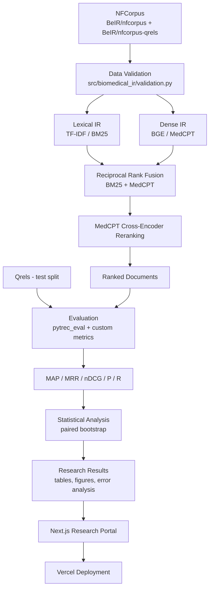

# System Architecture

Full pipeline for the Hybrid Biomedical IR study (CAP 6776). Every stage below
either has a concrete implementation in `src/biomedical_ir/` + a script in
`scripts/`, or is marked pending in [docs/reproducibility.md](reproducibility.md)
and the project README's status table.

## Pipeline stages

| # | Stage | Module | Script |
|---|-------|--------|--------|
| 1 | Dataset ingestion | `biomedical_ir/data.py` | `scripts/download_data.py` |
| 2 | Dataset validation | `biomedical_ir/validation.py` | `scripts/audit_dataset.py` |
| 3 | Lexical preprocessing | `biomedical_ir/preprocessing.py` | - |
| 4 | TF-IDF (M1) | `biomedical_ir/tfidf.py` | `scripts/run_tfidf.py` |
| 5 | BM25 (M2) | `biomedical_ir/bm25.py` | `scripts/run_bm25.py` |
| 6 | General dense retrieval (M3, BGE) | `biomedical_ir/dense.py`, `faiss_index.py` | `scripts/run_bge.py` |
| 7 | Biomedical dense retrieval (M4, MedCPT) | `biomedical_ir/medcpt.py`, `faiss_index.py` | `scripts/run_medcpt.py` |
| 8 | Hybrid RRF (M5) | `biomedical_ir/fusion.py` | `scripts/run_hybrid.py` |
| 9 | Cross-encoder reranking (M6) | `biomedical_ir/reranker.py` | `scripts/run_reranker.py` |
| 10 | Evaluation | `biomedical_ir/evaluation.py` | `scripts/evaluate_all.py` |
| 11 | Statistical testing | `biomedical_ir/statistics.py` | part of `evaluate_all.py` |
| 12 | Error analysis | `biomedical_ir/error_analysis.py` | part of `evaluate_all.py` |
| 13 | Efficiency analysis | `biomedical_ir/efficiency.py` | part of `evaluate_all.py` |
| 14 | Figures / tables | - | `scripts/generate_figures.py` |
| 15 | Web export | - | `scripts/export_web_results.py` |
| 16 | Research portal | `web/` (Next.js) | `npm run build` |

## Design decision: why RRF operates on ranks, not raw scores

BM25 scores and cosine/dot-product similarity scores live on incomparable
scales (unbounded vs. roughly [-1, 1] or [0, 1]). Summing them directly would
implicitly (and arbitrarily) weight one retriever over the other depending on
score magnitude, not retrieval quality. Reciprocal Rank Fusion instead
combines **rank positions**, which are already on a common scale by
construction — see `src/biomedical_ir/fusion.py` and Section 10 of the
project spec.

## Design decision: Vercel never runs the transformer models

Per Section 35 of the spec, BGE, MedCPT, and the MedCPT cross-encoder are
never invoked inside a Vercel serverless function. All embeddings/rankings
are computed offline (locally or in Colab), evaluated, and exported as
compact JSON/CSV artifacts under `results/` and `web/data/`. The Next.js
portal only reads those artifacts. The `/search` page is explicitly labeled
as showing **precomputed** experiment output, never a live model call.
